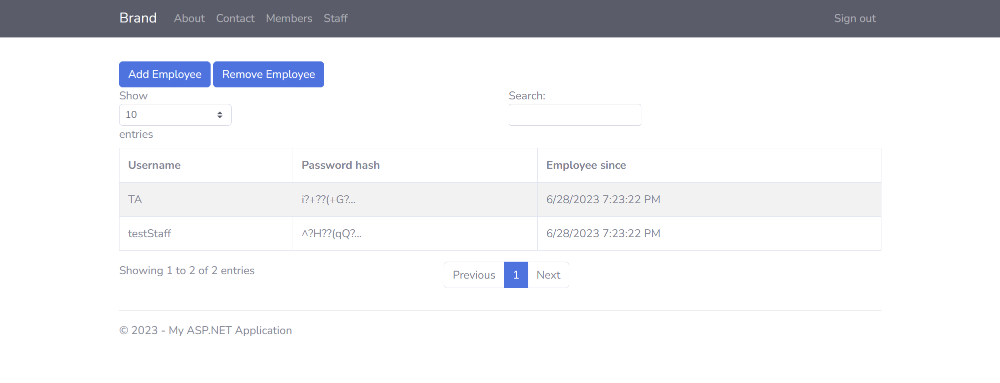

# Admin Dashboard

</img> 
</img> 

    
     Basic Web Application With User Authentication. Developed in C# with .NET 4.8 and WCF Web Services.

## Overview

    This repository contains the front and back end source code for a basic service oriented web application with user authentication. The application has three basic user types: Admin, Staff, and Members. Depending on the type of user, different interfaces and operations will be accessable. For example, Only Admins are able to add and remove Staff accounts. Both Admin and Staff can access the staff page to modify Member account information. Members may only access the members page and may only modify their own information. 

## Installation

    
    To run the application , follow these steps:

    1. Clone or download this repository to your local machine.
    2. Set up the necessary dependencies, including the .NET Framework 4.5 or above and the Windows Communication Foundation (WCF) runtime.
    3. Build and launch the solutions(F5)
    

## License

    
    This program is licensed under the MIT License. See the [LICENSE](LICENSE) file for more information.
    

